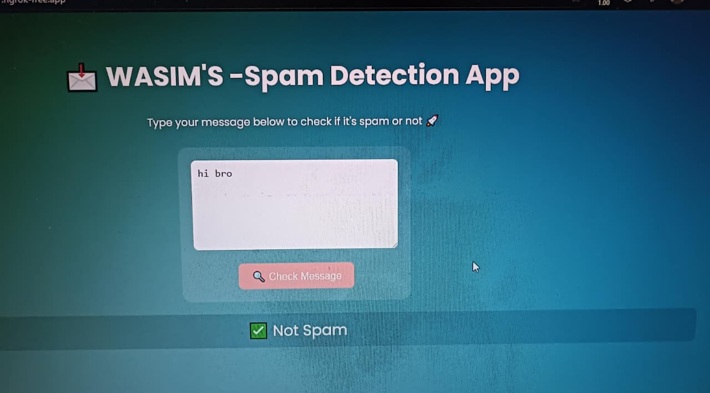
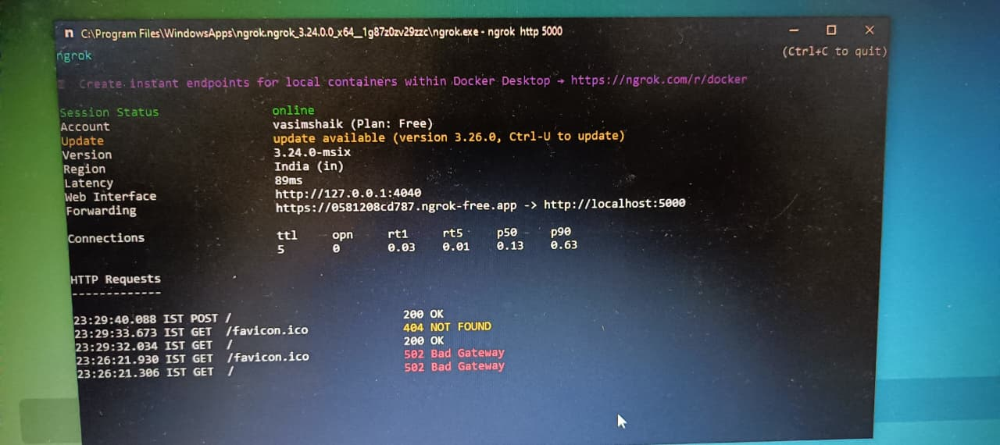
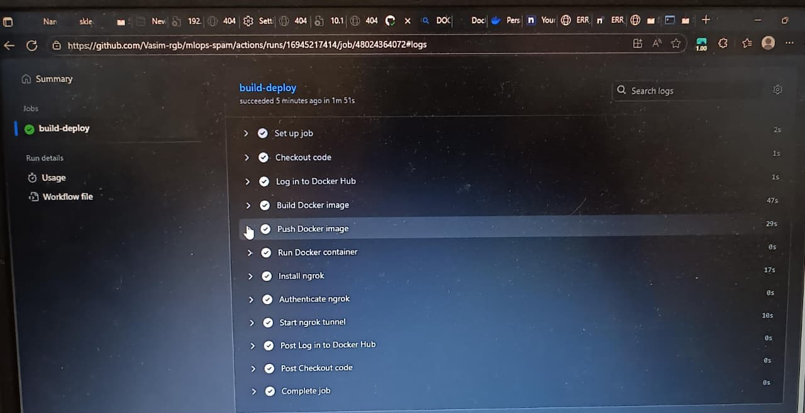

# Flask ML App Deployment via GitHub Actions + Docker + Ngrok

This project demonstrates *CI/CD* for a Flask-based Machine Learning app using *GitHub Actions, **Docker, and **ngrok*.

  
It automates:
1. *Building* a Docker image for the app.
2. *Pushing* the image to DockerHub.
3. *Deploying* the container locally on *port 5000*.
4. *Opening* an ngrok tunnel to make it accessible publicly.
